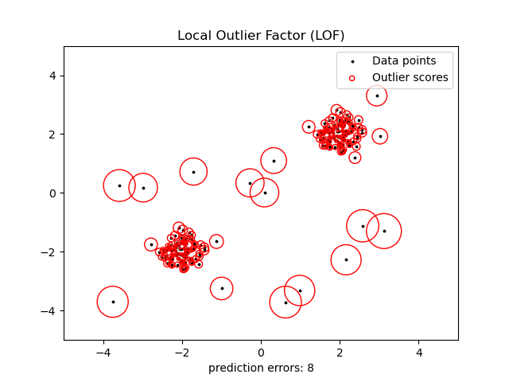

# NLP-Exploratory-Pipeline-HateSpeech


  

*An Industrial-Grade Framework for Unsupervised Hate Speech Discovery & French Linguistic Anomaly Detection*

*Paris 8 University - 2021-22 Original*

*2026 Refactored for Translation.*

---

## 📌 Overview
This repository hosts a comprehensive NLP (Natural Language Processing) pipeline specifically engineered to audit, clean, and analyze massive French social media datasets (1M+ entries). Unlike traditional keyword-based filters, this framework leverages Unsupervised Learning—specifically the Local Outlier Factor (LOF) algorithm—to identify hate speech as a statistical anomaly within linguistic density.

Developed as a core research component during my Bachelor's degree, this project demonstrates a transition from raw data ingestion to scientific insight, focusing on French semantic specificities and high-performance data processing.

⚖️ `GDPR & Ethics Note`:
>In compliance with GDPR regulations, all raw datasets containing PII (Personally Identifiable Information) have been strictly removed from this repository. This project focuses on the Engineering Architecture, French Transformation Logic, and Statistical Reporting.
>
>Disclaimer on Residual Data:   
>While a "Best Effort" approach was applied to sanitize the processed outputs (lemmatized/stemmed data and reports) using automated filters, the complex and unpredictable nature of social media content means that some residual PII may occasionally persist.
>* Commitment to Privacy: This data is shared for academic and research purposes only.
>* Correction Policy: If you identify any sensitive information or PII within the reports, logs, or processed samples, please open a GitHub Issue or contact the author directly for immediate removal.


## 🛠 Tech Stack

* **Language**: Python 3.9+
* **NLP Engines**: SpaCy (fr_core_news_sm), NLTK (SnowballStemmer).
* **Vectorization**: Gensim (Word2Vec).
* **Machine Learning**: Scikit-Learn (Local Outlier Factor, K-Means).
* **Data Handling**: NumPy, Pandas, Regex (Optimized for French Unicode).

## 🏗 Project Architecture

The repository is organized into a modular hierarchy to separate the reusable engine from the experimental research:
* 📂 **01-Core-Engine**  
*The "Dependency" layer containing production-ready libraries and resources.*

    *   **LibClean.py**: The transformation engine (Normalization, Lemmatization, Stemming, and Privacy Filtering).
    *   **LibEvalData.py**: The auditing tool for frequency analysis and baseline reporting.
    *   **LexHaine.txt** & **stopW.txt**: Custom-built linguistic resources for French hate speech detection.

* 📂 **02-Notebooks**  
*The "Narrative" layer. Sequential steps of the exploratory data analysis (EDA).*

    *   **00_Data_Inspection.ipynb**: Initial data profiling and noise identification.
    *   **01_Preprocessing.ipynb**: Deep cleaning pipeline (handling French ligatures, URLs, and handles).
    *   **02_Deduplication.ipynb**: Memory-efficient deduplication for large-scale datasets.
    *   **03_LOF_Implementation.ipynb**: Unsupervised anomaly detection using Scikit-Learn.
    *   **04_Cluster_Analysis.ipynb**: Advanced refinement of outliers within pre-fabricated clusters.

* 📂 **03-Experiments-Reports**  
*The "Evidence" layer containing benchmarks and statistical proof.*

    *   **Comparative Benchmarks**: Results from 4 normalization strategies (Lemmatization vs. Stemming vs. Minimalist).
    *   **Statistical Reports**: .txt files documenting outlier density and hate speech concentration (e.g., stemk3_analysis_report.txt).

## 🔬 Scientific Methodology: Why LOF?

The core innovation of this pipeline is treating hate speech as a statistical outlier relative to "neutral" linguistic densities.

**Theoretical Framework:**  
In theory, hate speech is not inherently an outlier—it is a widespread phenomenon. However, within a massive, unfiltered social media stream, "standard" or "neutral" content forms the dominant, high-density clusters in the vector space.

By operationalizing hate speech as a Local Outlier, this framework focuses on:
* **Linguistic Isolation**: Identifying messages that settle in low-density regions because their French linguistic signatures (syntax, vocabulary isolation) diverge from the mainstream "neutral" clusters.

* **Local Reachability Density (LOF)**: Instead of using global thresholds, the LOF algorithm detects "linguistic islands." This allows for the discovery of complex, evolving hate speech patterns that standard regex filters or global frequency analyses would miss.

<p align="center">
  
  <span style="display: block; text-align: center;">
    <em>Conceptual visualization of the Local Outlier Factor (LOF) algorithm. <br>
     The radius of the red circles is proportional to the local outlier score. <b><a href="https://scikit-learn.org/stable/auto_examples/neighbors/plot_lof_outlier_detection.html">Source</a></b></em>
  </span>
</p>


## 🚀 Key Engineering Features

* **Semantic Normalization**: Custom handling of French-specific characters (œ, æ) and multi-step lemmatization/stemming trade-offs.
* **Privacy by Design**: Automated sanitization of Twitter Handles, URLs, and PII to ensure dataset safety and GDPR compliance.
* **Scalable Architecture**: Deduplication and auditing logic optimized for millions of rows.
* **Automated Reporting**: A built-in evaluation system that generates quantitative precision reports for each experiment.

##  ⚙️ Getting Started

Clone the repo:
```Bash
 git clone https://github.com/MickaelDP/NLP-Exploratory-Pipeline-HateSpeech.git
```

Install dependencies:
```Bash
 pip install -r requirements.txt
```

Download SpaCy model:
```Bash
 python -m spacy download fr_core_news_sm
```

*Explore: Start with 02-Notebooks/00_Data_Inspection.ipynb to see the initial audit logic.*